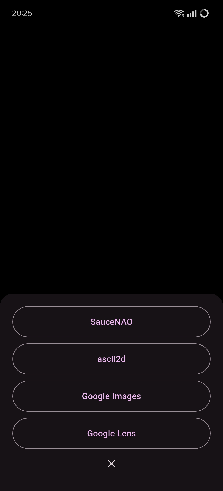

# Aubretia

Aubretia is image-search application built with Flutter. 

The app supports sharing images from other applications and provides a simple interface to search using popular image search engines.

## Features

- **Image Sharing**: Share images from other apps directly to Aubretia.
- **Multiple Search Options**: Search images using:
  - SauceNAO
  - Ascii2d
  - Google Images
  - Google Lens


## Getting Started

### Prerequisites

- Flutter SDK installed on your machine.
- An Android device or emulator for testing.

### Installation

1. Clone the repository:
   ```bash
   git clone https://github.com/icosane/aubretia.git
   cd aubretia
   ```
2. Install the dependencies:
    ```bash
    flutter pub get
    ```
3. Run the app:
    ```bash
    flutter run
    ```
### Download APK

You can also download the APK directly from the [releases](https://github.com/icosane/aubretia/releases) tab. Simply select the latest release and download the APK file to install it on your Android device.

### Usage

1. Open the app on your Android device.
2. Share a direct link to an image from any app to Aubretia.
> **Note**: Ensure that the link is a direct URL to the image (e.g., ending in .jpg, .png, etc.).
    
3. A bottom sheet will appear with options to search the shared image using different services.
    
4. Tap on the desired service button to initiate the search.


### Acknowledgments

- [Flutter](https://flutter.dev/) - The framework used to build this app.
- [flutter_sharing_intent](https://pub.dev/packages/flutter_sharing_intent) - Package for handling shared intents.
- [url_launcher](https://pub.dev/packages/url_launcher) - Package for launching URLs.
- [flower icons](https://www.flaticon.com/free-icons/flower) - Flower icons created by jocularityart - Flaticon.

### UI



